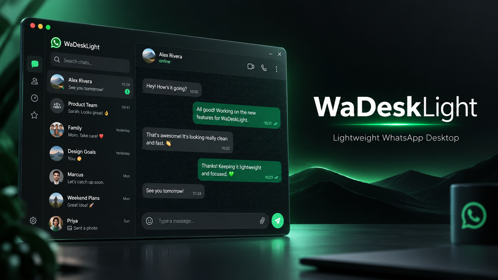

<p align="center">
  
</p>

<h3 align="center">Lightweight WhatsApp Desktop Client for Windows</h3>

<p align="center">
  Built with Go + WebView2. No Electron. No bloat. Just WhatsApp.
</p>

---

## About

**WaDeskLight** is a minimal, native Windows wrapper for WhatsApp Web. Instead of bundling a full Chromium engine like Electron apps, it uses the WebView2 runtime already present on Windows 10/11 to render WhatsApp Web in a clean, dark-themed window with system tray integration.

Originally forked from [Adytm404/whatsapp-web.view](https://github.com/Adytm404/whatsapp-web.view), this project has been heavily reworked with new features, performance improvements, and a fresh identity.

## Highlights

| Feature | Details |
|---------|---------|
| Ultra-lightweight | ~3 MB executable, no bundled browser engine |
| System tray | Minimize to tray on close, restore with single click |
| Dark mode | Native dark title bar and window frame |
| Persistent session | WhatsApp login survives app restarts |
| Window memory | Remembers size and position between sessions |
| Notifications | Tray balloon notifications for incoming messages |
| Calls support | Camera and microphone passthrough for voice/video calls |
| Single instance | Only one window at a time, duplicate launches auto-focus existing window |
| High-DPI | Full PerMonitorV2 DPI awareness |
| Auto-detect WebView2 | Shows install prompt if WebView2 Runtime is missing |

## Quick Start

1. Download [`WhatsApp.exe`](https://github.com/rayss868/WaDeskLight/releases/latest) from Releases
2. Run it, scan the QR code with your phone
3. Allow camera/mic access when Windows prompts you
4. That's it — your session is saved automatically

## Session & Data

All profile data (cookies, localStorage, IndexedDB) is stored locally:

```text
%APPDATA%\WaDeskLight\UserData
```

Back up this folder to preserve your login. Deleting it will require re-pairing your device.

## Building from Source

**Prerequisites:**
- [Go](https://go.dev/dl/) 1.22+
- [MinGW-w64](https://www.mingw-w64.org/) or TDM-GCC (for `windres`)

```powershell
# Generate resource object
windres resource.rc -O coff -o rsrc.syso

# Build (hidden console window, stripped binary)
go build -ldflags="-H windowsgui -s -w" -o WhatsApp.exe .
```

The output `WhatsApp.exe` includes embedded icon, DPI manifest, and Windows VERSIONINFO metadata.

## Tech Stack

- **Language:** Go
- **WebView:** [go-webview2](https://github.com/jchv/go-webview2) (Microsoft Edge WebView2)
- **Tray:** Win32 `Shell_NotifyIconW` API
- **Window frame:** `DwmSetWindowAttribute` for dark mode
- **Notifications:** System tray balloon via `NIF_INFO`

## Project Layout

```
whatsapp-web.view/
├── main.go           # Application entry point, WebView2 setup, tray, notifications
├── icon.ico          # Application icon
├── resource.rc       # Windows resource script (icon, manifest, version info)
├── rsrc.syso         # Compiled resource object
├── app.manifest      # DPI awareness and Common Controls manifest
├── banner.png        # Project banner
├── gen_icon.py       # Icon generation helper
├── go.mod / go.sum   # Go module definition
└── vendor/           # Vendored dependencies
```

## Disclaimer

This project is **not affiliated with or endorsed by WhatsApp LLC or Meta Platforms, Inc.** It is an independent, open-source tool that wraps the official WhatsApp Web interface. Use at your own discretion.

## License

This project does not currently have a declared license.
